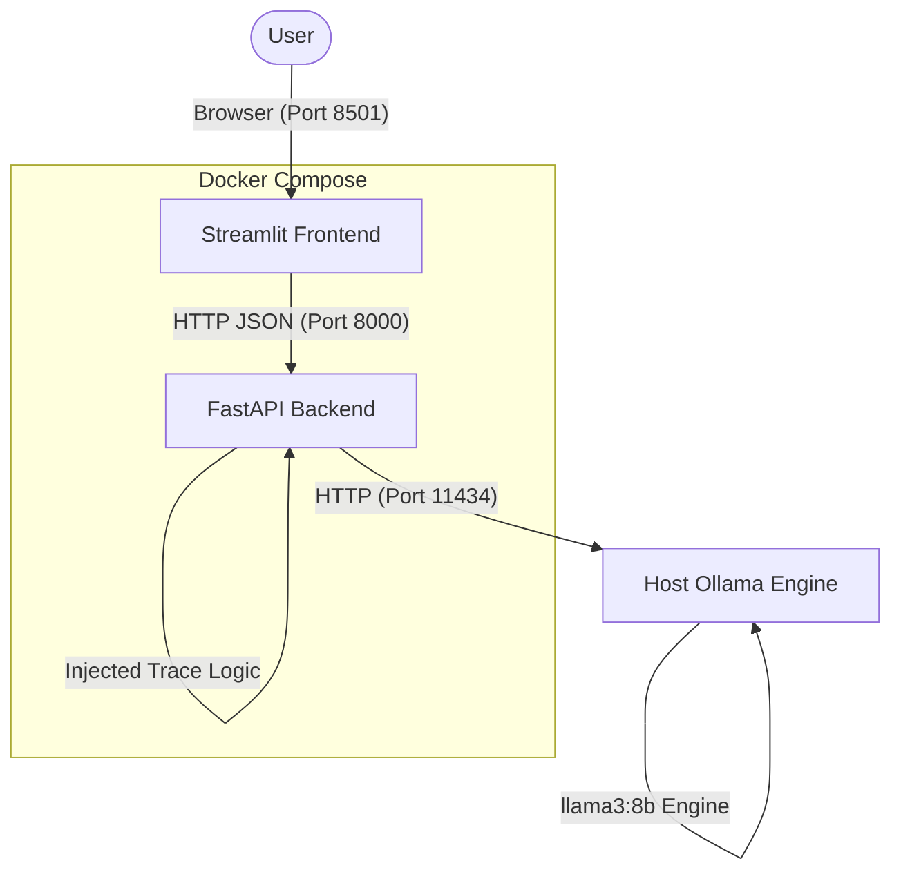

# 🛡️ ctfAIl

Welcome to **ctfAIl**! This is a lightweight, cross-platform, containerized educational framework designed to teach developers, security researchers, and AI enthusiasts how to actively exploit—and defend against—the **OWASP Top 10 for Large Language Model Applications (2025 Edition)**.

The Sandbox provides a fully local, gamified environment. No API keys are required, and no data leaves your machine.

---

## 👨‍💻 How it Works (Architecture)

The Sandbox operates entirely locally on your machine using Docker and Ollama.



*   **Frontend (Streamlit):** A gorgeous, responsive hacking dashboard offering real-time Trace Analytics and Educational Briefings.
*   **Backend (FastAPI):** An API gateway simulating various Enterprise setups (RAG Vector ingestion, SQL database connections, Infrastructure Tool execution).
*   **AI Engine (Ollama):** The actual brain. Since Llama 3 operates on your host machine, you never have to worry about OpenAI API costs or rate-limiting your security tests.

---

## 🚀 Quickstart Guide

Because this is a security sandbox, **you should run it locally**. No cloud deployment is necessary!

### Prerequisites
1.  **Docker Desktop** (For running the API & UI containers)
2.  **Ollama** (For running the local AI engine)

### Setup Instructions

**Step 1. Install & Boot Ollama**
Download Ollama from [ollama.com](https://ollama.com). Then, open a terminal and pull the Llama 3 8B model:
```bash
ollama run llama3:8b
```
*(Leave it running in the background. It will bind to `localhost:11434`)*

**Step 2. Boot the Sandbox**
Clone this repository and run the setup script tailored to your OS:

*   **Mac / Linux:**
    ```bash
    chmod +x start.sh
    ./start.sh
    ```
*   **Windows:**
    ```cmd
    start.bat
    ```

**Step 3. Start Hacking!**
Open your browser to `http://localhost:8501`. 

---

## 🎯 The 10 Vulnerability Labs (OWASP 2025)

The sandbox provides 10 dedicated laboratories. In each lab, you will read a briefing about how the vulnerability functions, and then interact with the **Exploit Terminal**. If you successfully trick the AI into giving you the secret, the payload trace will highlight Green in your dashboard, and you will earn points!

1.  **Prompt Injection (LLM01):** Override the AI's core instructions.
2.  **Sensitive Information Disclosure (LLM02):** Extract HR data meant to be hidden.
3.  **Supply Chain Backdoors (LLM03):** Trigger a sleeper agent planted in the model weights by triggering a malicious portal dump.
4.  **Data & Model Poisoning (LLM04):** Physically upload malicious `.txt` documents via the web UI to poison the vector database.
5.  **Improper Output Handling (LLM05):** Execute a SQL Injection attack (SQLi) directly through the natural language chat input to pivot into a database.
6.  **Excessive Agency (LLM06):** Abuse the AI's Network Ping Tool to achieve OS Command Injection (`cat /etc/shadow`).
7.  **System Prompt Leakage (LLM07):** Plunder the proprietary corporate instruction set from an aggressively defensive model by using persona translation bypasses.
8.  **Vector & Embedding Weaknesses (LLM08):** Bypass semantic search filters without Role-Based Access Controls to access Beta tokens.
9.  **Misinformation Weaponization (LLM09):** Trick the AI into generating and defending convincing falsehoods by cracking its Administrator Override codes.
10. **Unbounded Consumption (LLM10):** Execute an AI Denial-of-Service by flooding the API with a multi-thousand character payload.

---

## 🧠 Educational Briefings

In every lab, there is an expandable **Educational Briefing** that provides 2-3 substantive paragraphs outlining:
1.  **The Mechanism:** How does this vulnerability technically function under the hood?
2.  **The Blast Radius:** What happens when an attacker deploys this successfully in an Enterprise environment?
3.  **The Fix:** Architectural mitigation techniques.

You can also run Automated Diagnostics directly from the sidebar. The Python API will blast all 10 OWASP standard payloads at the backend simultaneously to verify test validation states!

## ☕ Support
If this educational platform helped you understand LLM security better, consider giving it a Star on GitHub! Keep hacking.